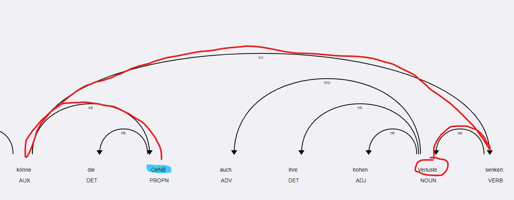

# Aspect-Based Sentiment Analysis (ABSA) - Methoden

Es werden 3 Methoden für die Aspect-Based Sentiment Analysis (ABSA) vorgestellt und durchgeführt:

## 1. **Regelbasierte Methode**

Hier wird untersucht, in welcher Beziehung die Entitäten mit den Sentimentträgern stehen. 

### Vorgehen

- **Aspekte identifizieren**: Zunächst müssen die Aspekte in den Texten identifiziert werden. Dies geschieht mit dem Entity-Ruler von spaCy. Der Entity-Ruler ist ein Werkzeug in spaCy, das ermöglicht, Entitäten in Texten regel- bzw. musterbasiert zu erkennen und zu extrahieren.

- **Sentimentträger identifizieren**: Anschließend müssen die Sentimentträger in den Texten identifiziert werden. Dies geschieht, indem ein Lexikon von Sentimentträgern verwendet wird, das eine Liste von Wörtern oder Phrasen enthält, die positive oder negative Meinungen ausdrücken.

- **Beziehungen analysieren**: Schließlich muss die Beziehung der Sentimentträger mit den identifizierten Aspekten untersucht werden. Hierfür wird Dependency-Parsing durchgeführt. Die Verknüpfung erfolgt in der Regel durch die Identifizierung von Abhängigkeiten zwischen den Wörtern im Satz, indem die Baumstruktur des Satzes analysiert wird und dabei bis zu einer bestimmten Tiefe in der Baumstruktur gesucht wird.

### Stärken

- **leicht zu interpretieren:**\
Die Ergebnisse sind leicht zu interpretieren, da sie auf den Regeln und Mustern basieren, die in den Texten identifiziert wurden.

### Schwächen

- **Abhängigkeit vom Parser:**\
Die Genauigkeit dieser Methode steht und fällt mit dem Parser. Besonders die Analyse der Beziehungen birgt bei steigender Komplexität des Satzes große Herausforderungen.
- **Parameter:**\
Die Wahl der Parameter ist entscheidend für die Güte der Ergebnisse. Hierzu zählen:
  - Die Wahl des Lexikons (z.B. SentiWS)
  - Die Definition des Entity-Rulers (z.B. welche Regex-Patterns eignen sich um die Entitäten zu erfassen?)
  - Die Wahl der Abhängigkeiten (z.B. nur Subjekt-Verb-Objekt-Beziehungen oder auch Adverbien und Adjektive)
  - Die Wahl der Tiefe der Analyse (z.B. nur bis zur ersten Ebene oder auch bis zur zweiten Ebene)
  - Die Wahl der Boost- und Negations-Wörter (z.B. "sehr", "extrem", "nicht", "kein")
  - Die Wahl der Gewichtung der Boost- und Negations-Wörter (z.B. "sehr" = 1, "extrem" = 2, "nicht" = -0.5, "kein" = -0.5)
  - Verfallsparameter (z.B. wie sehr sollen die Sentimentträger abgewertet werden, wenn sie nicht in der Nähe des Aspekts stehen?)

### Fazit

Die Ergebnisse dieser Methode sind sehr gut zu interpretieren, da sie auf den Regeln und Mustern basiert, die in den Texten gefunden werden.
Daher eignet sie sich besonders, um bspw. eine Feinanpassung eines Modells für ein Downstream-Task zu ermöglichen. Die Ergebnisse sind jedoch nicht immer zuverlässig, da sie stark von den gewählten Parametern abhängen. Daher ist es wichtig, die Parameter sorgfältig auszuwählen und die Ergebnisse zu validieren.

## 2. **Zero-Shot Klassifikation mit NLI-Methode**

https://huggingface.co/joeddav/xlm-roberta-large-xnli

Zero-Shot-Modelle lösen Klassifikationsprobleme, indem sie prüfen, ob eine Hypothese aus einem Text (**Prämisse**) folgt (entailment). Diese Eigenschaft lässt sich ausnutzen, um ABSA-Probleme ebenfalls in eine NLI-basierte Klassifikation umzuwandeln. Die ABSA-Aufgabe wird also einfach in eine Frage nach der semantischen Plausibilität eines Sentiments pro Aspekt übersetzt. Auf diese Weise lässt sich für jeden Aspekt prüfen, welche Sentiment-Klasse am wahrscheinlichsten zutrifft.

____

**Beispiel**:

- **Hypothese 1**: "Österreichische Nationalbank (OeNB); positive Erwähnung im folgenden Artikel: {**Prämisse**}"

- **Hypothese 2**: "Österreichische Nationalbank (OeNB); negative Erwähnung im folgenden Artikel: {**Prämisse**}"

- **Hypothese 3**: "Österreichische Nationalbank (OeNB); neutrale Erwähnung im folgenden Artikel: {**Prämisse**}"

____

Hier wird ABSA exakt als ein NLI-basiertes Klassifikationsproblem umformuliert: Der Text wird einzeln auf jede Hypothese geprüft, um zu bestimmen, welche Sentiment-Kategorie auf die Erwähnung zutrifft. Das Modell evaluiert quasi, ob es gerechtfertigt ist ("entailment"), eine derartige Aussage über den Artikel zu treffen.

### Vorgehen

- **Hypothesentemplate formulieren**: Es ist zu formulieren, welche Hypothesen getestet werden sollen. Diese Hypothesen sind in der Regel allgemeine Aussagen über die Entität, die im Text erwähnt wird. Zum Beispiel: "Die OeNB wird positiv erwähnt.". Die dazugehörige Prämisse ist der Textabschnitt, in dem die Entität erwähnt wird. Aus den in "Sonstiges" erläuterten Gründen ist es sinnvoll, die Hypothesen auf eine binäre Sentimentklassifikation ("positiv", "negativ") mit Multi-Label-Classification umzustellen, anstatt eine Single-Label-Klassifikation ("positiv" "neutral" "negativ") durchzuführen.

- **Granularität bestimmen**: Das Modell kann auf verschiedenen Granularitäten arbeiten. Es kann entweder auf Satz- oder Paragraphenebene arbeiten. Auf Satzebene wird jeder Satz einzeln analysiert, während auf Paragraphenebene der gesamte Paragraph analysiert wird. In den Trainingsdaten sind die Prämissen und die Hypothesen in der Regel auf Satzebene formuliert.

- **Ergebnisse aggregieren**: Schließlich müssen die Ergebnisse (Wahrscheinlichkeiten) auf der Satz- oder Paragraphenebene aggregiert werden. Anschließend müssen Thresholds definiert werden, um die Ergebnisse in die Klassen "positiv", "negativ" und "neutral" zu klassifizieren.

### Sonstiges

- **Zero-Shot Klassifikation über NLI-Modelle** basiert auf der semantischen Ähnlichkeit zwischen Inputtext und Hypothese. Die Klasse "neutral" ist semantisch oft schwierig zu definieren, weil Neutralität meistens durch das Fehlen eindeutiger Hinweise auf positives oder negatives Sentiment definiert ist.

- Die binäre Klassifikation (positiv vs. negativ) ermöglicht es dem Modell, deutlicher zwischen zwei klar unterscheidbaren Sentiment-Polen zu differenzieren, was die Genauigkeit erhöhen kann.

- Mit der Einstellung `multi_label=True` kann das Modell gleichzeitig prüfen, ob es eindeutige Hinweise für beide Pole gibt.

- Wenn weder positive noch negative Signale stark ausgeprägt sind, wird es als "neutral" interpretiert (z.B. beide Werte niedrig).

- Das ermöglicht eine intuitivere Klassifikation von "neutral" als "kein eindeutiges Sentiment" und könnte die Qualität der Ergebnisse steigern.

### Stärken

- **Flexibel**: Die Methode ist flexibel und kann auf verschiedene Textarten angewendet werden.
- **Kein spezielles Training erforderlich**: Die Methode erfordert kein spezielles Training, da sie auf vortrainierten Modellen basiert.
- **Modell lernt implizite Zusammenhänge**: Das Modell lernt implizite Zusammenhänge zwischen Sentiment und Kontext, was die Genauigkeit der Ergebnisse erhöhen kann.

### Schwächen

- **Abhängigkeit von der Qualität der Hypothesen**: Die Qualität der Hypothesen ist entscheidend für die Genauigkeit der Ergebnisse. Wenn die Hypothesen nicht gut formuliert sind, kann das Modell Schwierigkeiten haben, die richtigen Beziehungen zu identifizieren.
- **Abhängigkeit von der Qualität des Modells**: Die Qualität des Modells ist entscheidend für die Genauigkeit der Ergebnisse.
- **Abhängigkeit von Aggregationsmethoden**: Es gibt eine Abhängigkeit von der Wahl der Aggregatsfunktion und der Schwellenwerte, die für die Klassifikation verwendet werden. 

### Umsetzung

**main_2_1:**
*Klassen*: positiv, negativ, neutral
*Multi-Label-Classification*: Nein
*Aggregationsstufe*: Paragraphenebene.

**main_2_2:**
*Klassen*: positiv, negativ
*Multi-Label-Classification*: Ja
*Aggregationsstufe*: Paragraphenebene.

**main_2_3:**
*Klassen*: positiv, negativ
"Multi-Label-Classification": Ja
*Aggregationsstufe*: Satzebene.

## **LLM-gestützte Methode**

Diese Methode verwendet Large Language Models (LLMs), um die Meinungen in den Texten zu analysieren. LLMs sind darauf trainiert, den Kontext und die Bedeutung von Wörtern und Sätzen zu verstehen, was nützlich sein kann, um die Meinungen in den Texten zu identifizieren und zu analysieren.

**main_3_1:**

- normales prompting

**main_3_2:**

- Aufforderung auf reasoning

**main_3_3:**

- Aufforderung auf reasoning
- nur auf Paragraphen, wo die Entität erwähnt wird
- Begründung wird mitgespeichert.